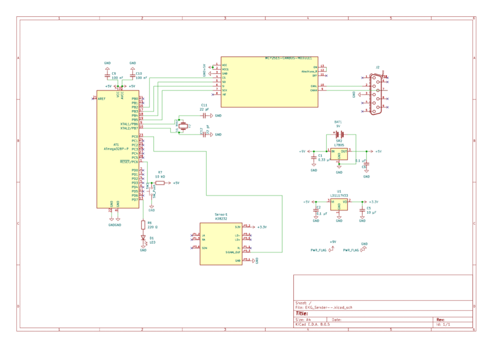
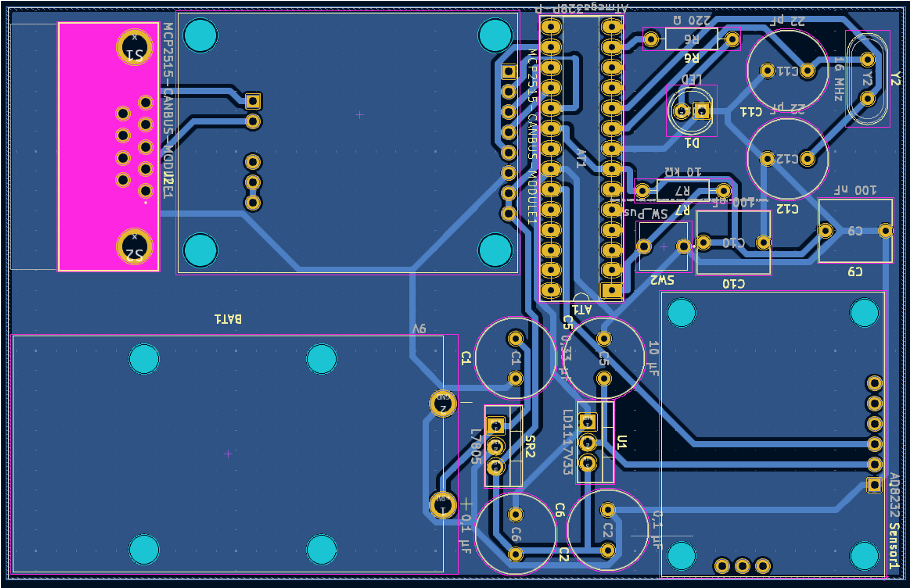
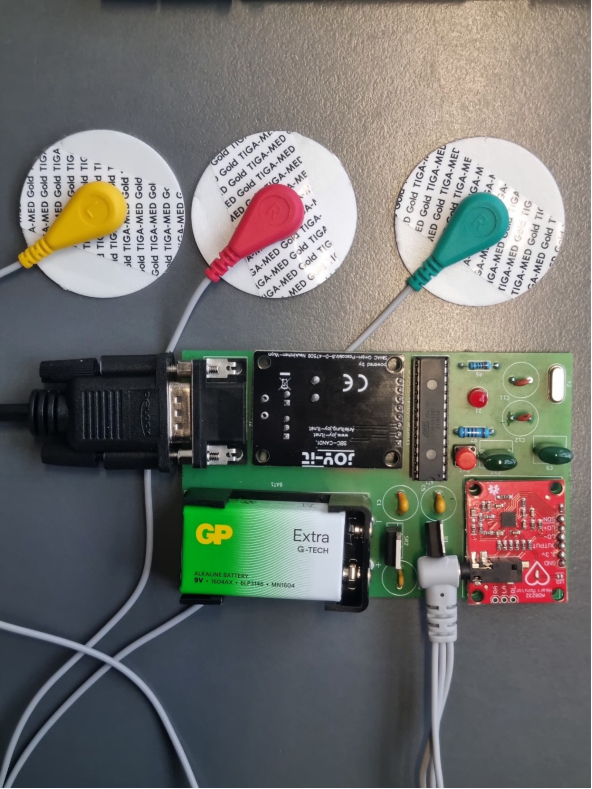
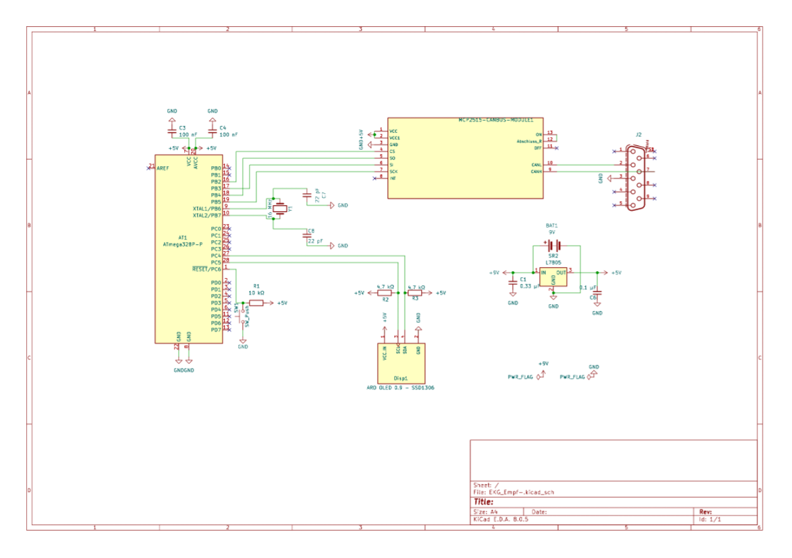
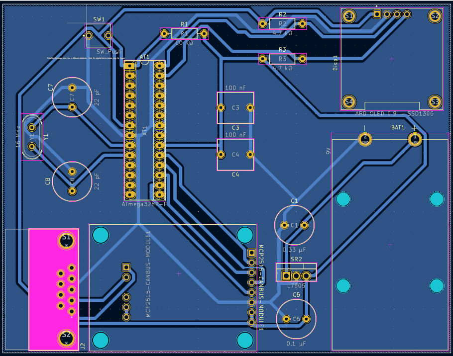
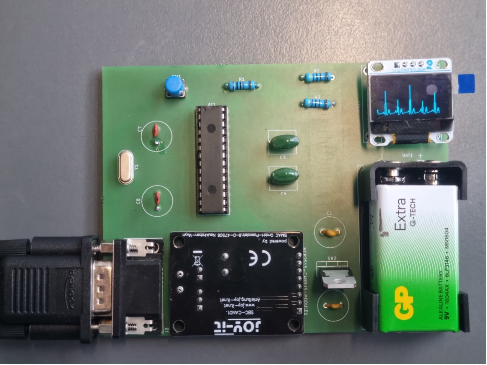

# EKG-CAN-Bus-System

Bachelorprojekt: EKG-Monitoring mit ATmega328P, MCP2515 (CAN) und OLED.
Implementiert funktionale Sicherheit durch Sicherheitsmechanismen wie Sequenznummern, Zeitstempel, Checksummen (XOR), Timeout und ACK/NACK.
Der Sender überträgt EKG-Daten mit eingebetteten Sicherheitsmerkmalen, der Empfänger validiert diese aktiv und überwacht die Datenintegrität in Echtzeit.

## Projektbeschreibung
Dieses System besteht aus:
- **Sender**: Liest EKG-Daten vom AD8232-Sensor und sendet sie über den CAN-Bus mit integrierten Sicherheitsmerkmalen.
- **Empfänger**: Empfängt die Daten, prüft Sequenznummer, Zeitstempel, Sender-ID und Checksumme und zeigt die EKG-Kurve in Echtzeit auf einem OLED-Display an. Bei Fehlern: Display-Fehlermeldung + NACK; LED blinkt.

### Merkmale
- Eigenes Schaltungsdesign & PCB-Layout (KiCad)
- CAN-Bus Kommunikation (MCP2515 + TJA1050)
- Sicherheitsmechanismen: Sequenznummer, Zeitstempel, Checksumme, Timeout, Rückmeldung (ACK/NACK)
- Echtzeitdarstellung des EKG-Signals auf SSD1306 OLED

---

## Software-Überblick

### Sender
[`Firmware/sender/main.cpp`](Firmware/sender/main.cpp)  
- Liest EKG-Daten vom AD8232-Sensor über A0.
- Sendet die Daten per MCP2515 (CAN, 1 Mbit/s) an den Empfänger.
- Erwartet eine Rückmeldung (ACK/NACK).

### Empfänger
[`Firmware/receiver/main.cpp`](Firmware/receiver/main.cpp)  
- Empfängt CAN-Daten.
- Prüft Sequenznummer, Zeitstempel und Prüfsumme (XOR).
- Zeigt die EKG-Kurve live auf SSD1306 OLED an.
- Sendet ACK/NACK zurück.

### Benötigte Bibliotheken
- [`MCP2515`](https://github.com/autowp/arduino-mcp2515) – CAN via SPI
- [`Adafruit SSD1306`](https://github.com/adafruit/Adafruit_SSD1306) – OLED Display
- [`Adafruit GFX`](https://github.com/adafruit/Adafruit-GFX-Library) – Grafikbibliothek für OLED
- `Wire` (I²C, Arduino Standardbibliothek)
- `SPI` (Arduino Standardbibliothek)

---

## Hardware

### Sender

### Empfänger

### Gesamtsystem

---

## Firmware

Der Quellcode für den **Sender** befindet sich im Ordner [`Firmware/sender/main.cpp`](Firmware/sender/main.cpp)  und für den **Empfänger** im Ordner [`Firmware/receiver/main.cpp`](Firmware/receiver/main.cpp).

Eine detaillierte Beschreibung, benötigte Bibliotheken und eine Schritt-für-Schritt-Anleitung zum Kompilieren findest du in  
[`Firmware/README.md`](Firmware/README.md).

---

## Lizenz
Dieses Projekt steht unter der [MIT-Lizenz](LICENSE).
